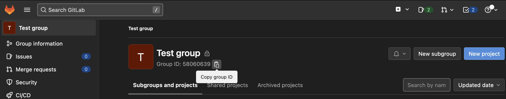

# GitLab Tree Clone (gltc)
A tool for recursively cloning a GitLab group tree of repositories.

## Highlights
- it's *fast* - each group and repo gets processed concurrently in its own goroutine
- supports ignoring groups based on either their names or GitLab IDs

## Installation
`make install`

## Usage
```
Usage: gltc [--ignore-id IGNORE-ID] [--ignore-name IGNORE-NAME] [--output-dir OUTPUT_DIR] --token TOKEN [GROUP_ID]

Positional arguments:
  GROUP_ID               ID of the GitLab group to use as tree root

Options:
  --ignore-id IGNORE-ID
                         If specified, subgroups with this ID will not be cloned. May be given multiple times
  --ignore-name IGNORE-NAME
                         If specified, subgroups with this name will not be cloned. May be given multiple times
  --output-dir OUTPUT_DIR, -o OUTPUT_DIR
                         target dir for cloning the group tree [default: .]
  --token TOKEN, -t TOKEN
                         GitLab API access token
  --help, -h             display this help and exit
```

### Group ID
The positional argument `GROUP_ID` expects a GitLab group ID to be provided.
To get the ID of the group you'd like to clone, head over to GitLab and copy it from the group's header (see screenshot below).



In the future, group ID usage might be replaced or complemented by referring to HTTP/SSH URLs for the groups.

### Examples
`gltc --token {API_TOKEN} --ignore-name archived {GROUP_ID}`

## TODO
- option/command to enable recursively pulling from existing git repos
- cross-compilation in `Makefile`
- tests :)